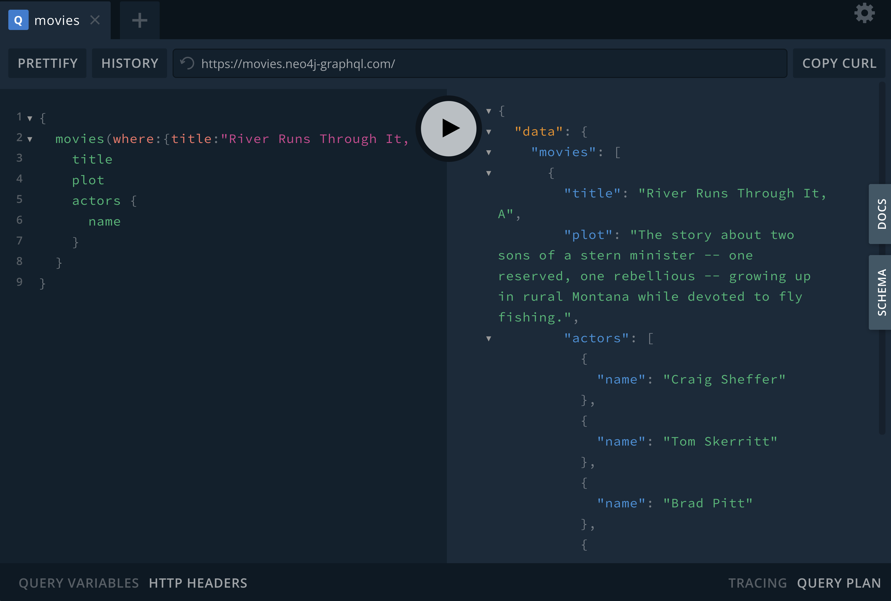
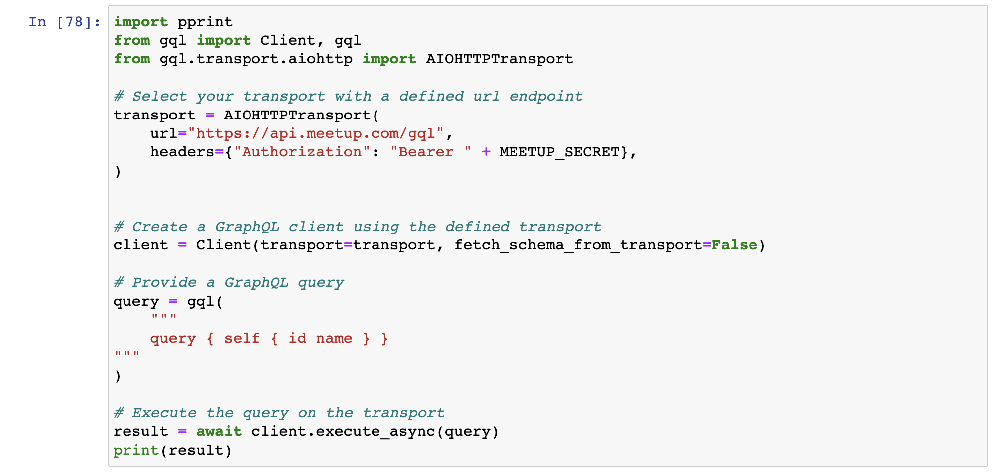

# GraphQL For Data Scientists


## Part 1: Introduction To GraphQL



  * [GraphQL overview slides]()

Try these queries in GraphQL Playground [movies.neo4j-graphql.com](https://movies.neo4j-graphql.com)

```GraphQL
{
  movies(options: { limit: 10, sort: { title: ASC } }) {
    title
  }
}
```

Who acted in the movie "Jurassic Park"?

```GraphQL
{
  movies(where: { title: "Jurassic Park" }) {
    title
    actors {
      name
    }
  }
}
```


What are the genres of "Jurassic Park"? 

```GraphQL
{
  movies(where: { title: "Jurassic Park" }) {
    title
    genres {
      name
    }
  }
}
```

* What other movies are in those genres?
* What movie has the highest `imdbRating`?

See [this readme](https://github.com/johnymontana/fullstack-graphql-book/blob/main/exercises/chapter1/solutions.md) for more exercises and solutions.

## Part 2: GraphQL As A Data Source



  * Querying GraphQL in Python using the GQL package - Meetup API
  * Working with GraphQL in DataFrames
  * Graph Data Science with Neo4j

Open in [Google Colab](https://colab.research.google.com/github/johnymontana/graphql-for-data-scientists/blob/main/notebooks/meetup.ipynb)

## Part 3: Exposing Data Science With GraphQL


  * Using the Neo4j GraphQL Library to expose the results of data science workflows (operationalize data science activities)

[Open in CodeSandbox](https://codesandbox.io/s/github/johnymontana/graphql-for-data-scientists/tree/main/graphql)

## Part 4: GraphQL Data Visualization


  * Neo4j Bloom
  * Using react-graph-viz-engine with GraphQL
